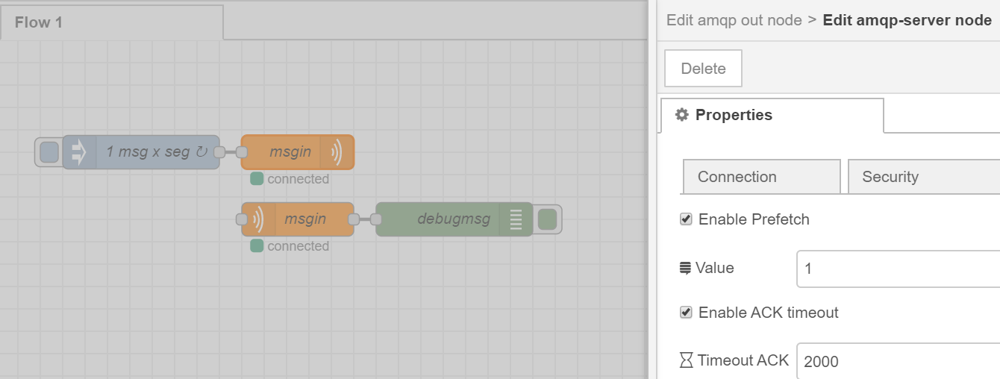
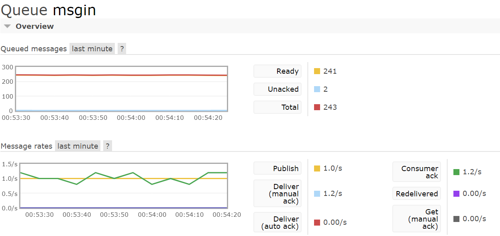

Node-RED AMQP input and output nodes
====================================


`node-red-contrib-amqp-ack` is a [Node-RED](http://nodered.org/docs/creating-nodes/packaging.html) package that connects directly to an AMQP server (e.g. [RabbitMQ](https://www.rabbitmq.com/)). It contains an input, an output and a configuration node to connect to AMQP exchanges or queues for Node-RED with ack control.

It uses the [amqp-ts](https://github.com/abreits/amqp-ts) library for the AMQP connectivity.

Thanks to [abreits](https://flows.nodered.org/user/abreits) for release [node-red-contrib-amqp](https://flows.nodered.org/node/node-red-contrib-amqp)


## Table of Contents
- [Installation](#installation)
- [Overview](#overview)
- [Prefetch](#prefetch)
- [Known issues](#knownissues)
- [What's new](#whatsnew)
- [Roadmap](#roadmap)
- [Fast developer](#developer)


## Installation     <a name="installation"></a>

If you have installed Node-RED as a global node.js package (you use the command `node-red` anywhere to start it), you need to install
node-red-contrib-amqp-ack as a global package as well:

```
$[sudo] npm install -g node-red-contrib-amqp-ack
```

If you have installed the .zip or cloned your own copy of Node-RED from github, you can install it as a normal npm package inside the Node-RED project directory:

```
<path/to/node-red>$ npm install node-red-contrib-amqp-ack
```

## Overview     <a name="overview"></a>

The package contains the following Node-RED nodes:

### input: amqp

Subscribes to an AMQP exchange or queue and reads messages from it. It outputs an object called
`msg` containing the following fields:
- `msg.payload` is a string or an object containing the content of the AMQP message.
- `msg.topic` is a string containing the routing-key of the AMQP message.
- `msg.amqpMessage` is an [amqp-ts Message](https://github.com/abreits/amqp-ts/wiki/Message%20class)
   object containing the received message.sendto

If a topic is defined in the input node definition, that will be sent as `msg.topic` instead of the routing key.

In the settings you can only define the exchange type or queue and it's name. If you need to use an exchange or a queue with specific settings you can define the exchange or queue in the [topology](#topology) tab of the AMQP server configuration node. The input node will use the exchange or queue defined in the topology.

You can send to the node `msg.readFrom` to received dynamically the name of the queue or exchange that will be read.

### input: ack

AMQP ack node. Return ack or nack for amqp in queue in the flow when finish the process.

### output: amqp

Delivers incoming the message payload to the specified exchange or queue. It expects an object called
`msg` containing the following fields:
- `msg.payload`: string or an object containing the content of the AMQP message to be sent.
- `msg.topic`: string containing the routing-key of the AMQP message to be sent.
- `msg.options`: object containing specific AMQP properties for the message to be sent, see the
  [amqplib publish](http://www.squaremobius.net/amqp.node/channel_api.html#channel_publish) documentation for more information.

If a topic is defined in the output node definition, that will be sent as routing-key instead of the `msg.topic`. If the `msg.payload` field does not exist, the whole msg object will be sent.

In the settings you can only define the exchange type or queue and it's name. If you need to use an exchange or a queue with specific settings you can define the exchange or queue in the **topology** tab of the AMQP server configuration node. The output node will use the exchange or queue defined in the topology.

### configuration: amqp-server

Defines the connection to the AMQP server. You can also define in more detail the exchanges and queues that are used in the input and output nodes and even define bindings between exchanges and queues in the topology tab.

#### topology tab     <a name="topology"></a>

In the topology tab you can define the AMQP server exchange and queue topology (exchanges, queues and bindings). You define the topology in the JSON editor.

Topology configuration example:

```JSON
{
    "exchanges": [
        {"name": "exchange1", "type": "direct", "options": {"durable": false}},
        {"name": "exchange2"}
    ],
    "queues": [
        {"name": "queue1", "options": {"messageTtl": 60000}},
        {"name": "queue2"}
    ],
    "bindings": [
        {"source": "exchange1", "queue": "queue1", "pattern": "debug", "args": {}},
        {"source": "exchange1", "exchange": "exchange2", "pattern": "error"},
        {"source": "exchange2", "queue": "queue2"}
    ]
};
```

## Prefetch <a name="prefetch"></a>

### Only Prefetch

Enable prefetch and limit the number of msg by consumer. **Atention**: The consumer get the msg it keeps **unacked** forever.


### Prefetch with timeout

With prefetch enable, can enable timeout per msg in ms. After the timeout the msg get **ACK**.




### Prefetch with ack node

We can use a node ACK for send the ACK when the process end, without set a fixed time. In this mode, is use a flow variable *amqpobjectsacks* to keep the tags for each msg, **only one input node** can use per flow.




### Prefetch with ack node and dynamic set queue

If use `msg.readFrom` in amqp in, ack node need a switch node for every queue name.


## Known issues     <a name="knownissues"></a>
- Entering invalid credentials (username/password) in the AMQP configuration node can cause node-red to malfunction
- Package library 'amqlib' is outdated, requiring breaking changes
- Build libraries 'typescript' and 'gulp-typescript' are outdated, requiring breaking changes
- Prefetch with timeout and with ack node can`t use simultaneous
- Prefetch with only one msg sometimes stuck with ack node if have old data in amqpobjectsack

## What's new     <a name="whatsnew"></a>

### version 1.1.1
- Change amqpobjectsacks to object map
- FIX declarations & lint code

### version 1.1.0
- FIX no more lost acks with high rate message 

### version 1.0.9
- FIX old values amqpobjectsacks when deploy and the variable is set
- FIX lost acks when channel closed and change consumer tag when reconnect
- FIX lost acks when msg rate is +75msg/seg _not recommended_

### version 1.0.8
- Remove clear amqpobjectsacks when old values, send message instead

### version 1.0.7
- FIX messages without objects acks

### version 1.0.6
- Add nack
- Change control ack from global to flow

### version 1.0.5
- Remove images in package.

### version 1.0.4
- Add credits.
- Add info for dynamically set the name of the queue or exchange in input nodes.

### version 1.0.3 
- enable prefect

### version 1.0.1
- bugfix, introduced by v1.0.0: Connections would not establish on startup, but would after a deploy.

### version 1.0.0
- Use Credentials/Credentials fields descriptions changed to 'Use Local CA File' and 'CA File Location' with accompanying functional change:
- The 'CA File Location' field no longer specifies an explicit certificate, but a local disk location to load

  This is important as many certs have binary data in them, which is incompatible with a copy/paste in NodeRed GUI.
- When a custom CA file location is not specified, an attempt is made to load the default system CA certificate

  Currently default supports ubuntu and alpine. 

  Other distros should contribute their locations to this project as desired, but could still manually enter the location to be able to enjoy the functionality.
  If you were previously using non-system-default cert text in an AMQP node, this update would be a breaking change.
- Some small GUI quality of life improvement to disable/enable TLS related fields when TLS enabled checkbox is exercised
- bugfix, 'Enable secure connection' + 'Use Local CA File' checkbox drives whether to use the 'CA File Location' field;

  before it would use the field even when the checkbox was unchecked
- Library dependencies upgraded to address all non-low vulnerabilities.  Remaining low vulnerability will require upgrading
  typescript and gulp-typescript, along with breaking updates.

### version 0.4.5
- Unknown, just documenting this version existed.  It is available in NPM, but not documented here

### version 0.4.4
- bugfix, topology editor not visible in amqp-server config node

### version 0.4.3
- bugfix, fixed routingkey not working in configuration/definition (thanks to exogenesick)

### version 0.4.0
- major refactor, made preparations for better testable code:
  - javascript source code has been translated to typescript
  - gulp build system added

### version 0.3.0
- connection to AMQP server now only established when amqp input and/or AMQP output nodes exist
- major refactor and code cleanup
- fixed errors in readme

### version 0.2.0
- fixed user credentials not working
- improved readme

### version 0.1.0
- initial release


## Roadmap     <a name="roadmap"></a>
- Resume active maintenance of the project into 2019!
- I would like to see version 1.1.0 aim to accomplish:
 * All dependencies upgraded to current
 * Test suite in place
 
## Fast developer <a name="developer"></a>
 - git clone repository
 - docker build . -f Dockerfile -t gulp:latest
 - docker run -v ${PWD}:/src gulp 
 - docker run -v ${PWD}:/install -p 1880:1880 --name noderedtest nodered/node-red:latest-minimal
 - docker exec -it noderedtest bash
 - cd /usr/src/node-red/
 - npm install /install
 - exit
 - docker restart noderedtest


